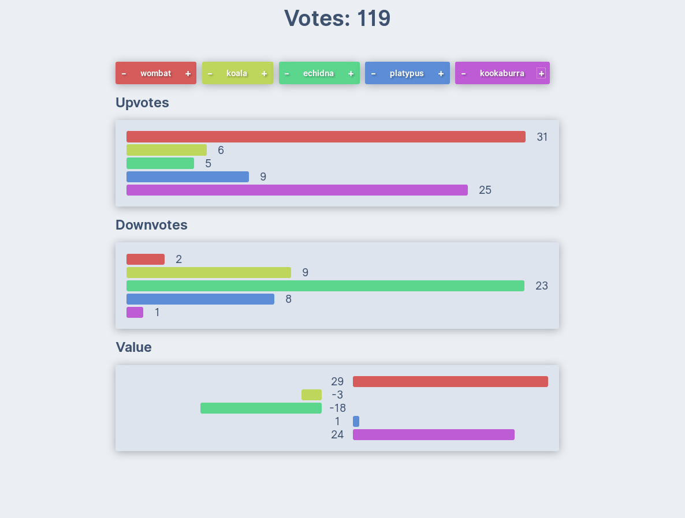

# Multiple graphql endpoints

Simple voting app showcasing GraphQL queries, mutations and subscriptions on multiple GraphQL endpoints.



## Directories

- **api** - express server acting as database containing animal voting data
- **main-server** - GraphQL endpoint handling queries
- **sub-server** - GraphQL endpoint handling mutations and subscriptions
- **client** - Apollo/React app that executes queries on the main-server as well as mutations & subscriptions on the sub-server

## Installation

```bash
git clone https://github.com/plexey/multiple-graphql-endpoints.git
cd multiple-graphql-endpoints
yarn
```

# Run

From the project root:

#### api
```bash
yarn start-api
```

#### main-server
```bash
yarn start-main-server
```

#### sub-server
```bash
yarn start-sub-server
```

#### client
```bash
yarn start-client
```